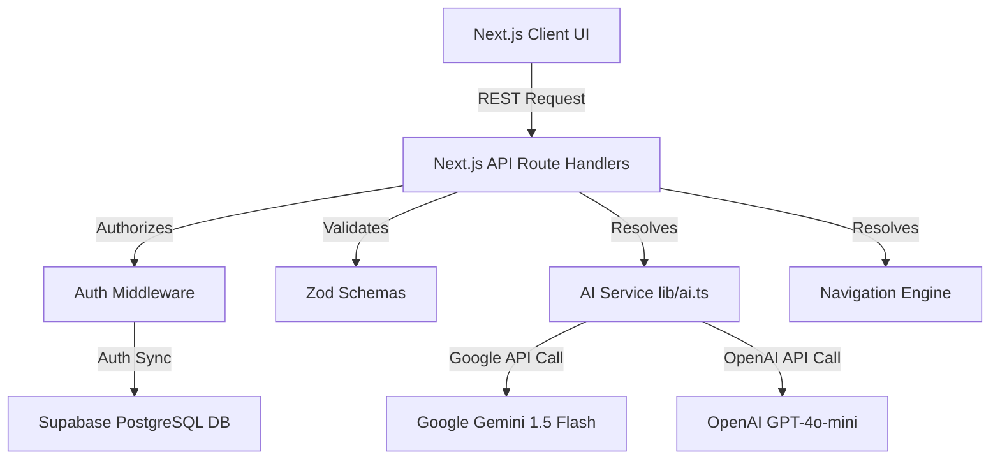
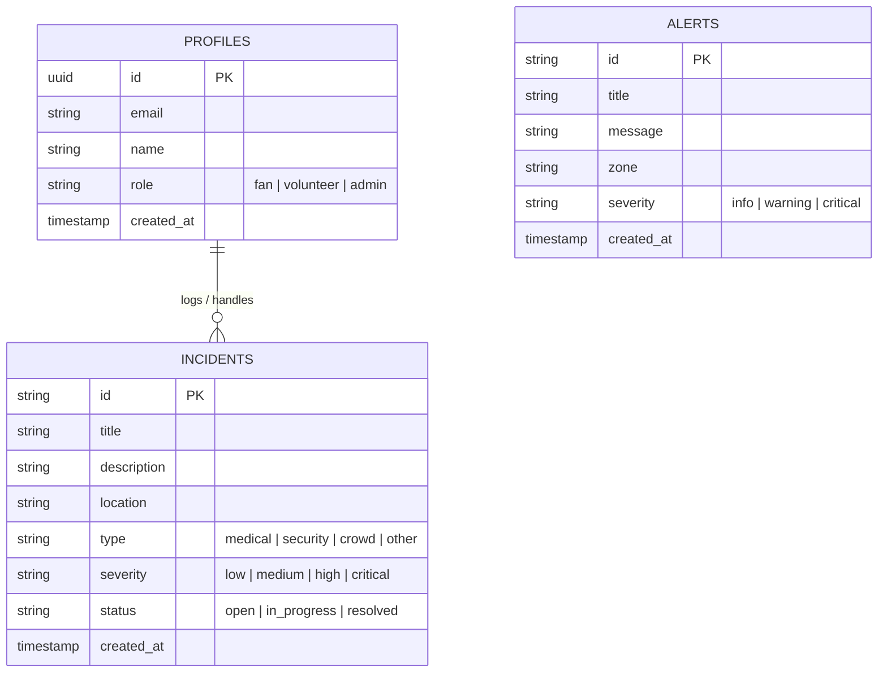

# System Architecture — StadiumAI

This document details the folder structure, system components, database ER schemas, and deployment topology for the StadiumAI application.

---

## 📁 Project Folder Structure

```text
stadium-ai/
├── e2e/                           # Playwright E2E integration specs
├── public/                        # Static PWA assets and fallback icons
├── src/
│   ├── __tests__/                 # RTL & Jest unit testing files
│   ├── app/
│   │   ├── api/
│   │   │   ├── ai/
│   │   │   │   ├── chat/          # Gemini AI chat endpoint
│   │   │   │   └── decision-support/ # Operations analyst route
│   │   │   ├── alerts/            # Critical alerts CRUD
│   │   │   ├── incidents/         # Volunteer incident logging
│   │   │   ├── navigation/        # Interactive route computing
│   │   │   └── sustainability/     # Live sustainability metrics
│   │   ├── admin/                 # Administrator dashboards
│   │   ├── fan/                   # Fan dashboards
│   │   ├── volunteer/             # Volunteer dashboards
│   │   ├── login/                 # Sign-in portal
│   │   ├── register/              # Signup portal
│   │   ├── globals.css            # Base design system + overlays
│   │   ├── layout.tsx             # Root frame container
│   │   └── page.tsx               # Mesh landing page
│   ├── components/                # Modular UI widgets
│   │   ├── AccessibilityBar.tsx   # Contrast & scale panel
│   │   ├── Chatbot.tsx            # conversational assistant
│   │   ├── EmergencyButton.tsx    # Pulse assist help button
│   │   ├── StadiumHeatmap.tsx     # live zone telemetry map
│   │   └── Navbar.tsx             # Floating sticky navigation header
│   └── lib/                       # Services and mock engines
│       ├── ai.ts                  # Google Generative AI connectors
│       ├── auth.ts                # Auth handler
│       ├── types.ts               # Types definitions
│       ├── mock-data.ts           # Preloaded database records
│       └── navigation.ts          # Zone route databases
```

---

## 🏗️ System Architecture Diagram



---

## 🗄️ Database Entity-Relationship (ER) Schema

StadiumAI utilizes standard entities for state handling and authorization, configured to automatically fallback to robust local/localStorage datasets in mock configurations.



---

## 🌐 Deployment Topology

```text
[Vercel Serverless Edge]
       │
       ├──> Serves React client dashboards (Admin, Volunteer, Fan)
       ├──> Manages Next.js Edge REST Routing
       │
       ├───( Secure Web fetches )───> [Google Generative AI Hub (Gemini)]
       │
       └───( Secure DB fetches )────> [Supabase Backend Server (PostgreSQL)]
```
